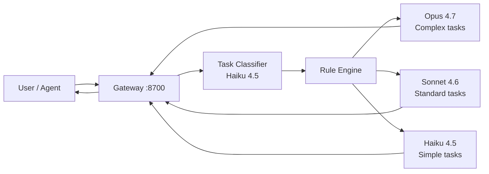

**[English](README.md) | [中文](README-zh.md)**

<h1 align="center">
  <br>
  ◈ Intelligent Model Router
  <br>
  <sub>Provider-Agnostic · Agent-Agnostic · Visual Config · Multi-Language</sub>
</h1>

<p align="center">
  <a href="#quick-start"></a>
  <a href="#license"></a>
  <a href="#"></a>
  <a href="#"></a>
  <a href="#agent-compatibility"></a>
  <a href="#supported-providers"></a>
  <br>
  <sub>Automatically detects task type, selects the optimal AI model, executes, and returns results — all through one gateway.</sub>
</p>

---

## What is Intelligent Model Router?

A **unified LLM gateway** that sits between your applications and 50+ AI model providers. It automatically analyzes each task, routes it to the most suitable model (Opus for architecture, Haiku for simple tasks, etc.), executes it, and seamlessly returns the result.

**The problem:** Every AI model excels at different tasks. Opus is great at system design but expensive for simple edits. Haiku is fast and cheap but can't handle complex reasoning. Manually choosing models wastes time and money.

**The solution:** One unified endpoint. Describe your task — the router handles model selection, provider routing, execution, and result aggregation automatically.



---

## Quick Start

### Prerequisites
- Python 3.10+
- An API key for at least one provider (Anthropic recommended)

### 3-Line Setup
```bash
git clone https://github.com/pengboyjak/intelligent-model-router.git
cd intelligent-model-router && pip install -r requirements.txt
python gateway.py --port 8701
```

Set your API key and open **http://localhost:8701**:
```bash
# Windows PowerShell
$env:ANTHROPIC_API_KEY = "sk-ant-..."

# macOS / Linux
export ANTHROPIC_API_KEY="sk-ant-..."
```

### Windows EXE (No Python Required)
Download `ModelRouter.exe` from [Releases](https://github.com/pengboyjak/intelligent-model-router/releases), then:
```bash
ModelRouter.exe --port 8701
```

### Docker (Coming Soon)
```bash
docker run -p 8701:8701 -e ANTHROPIC_API_KEY=sk-ant-... pengboyjak/intelligent-model-router
```

---

## Features

| # | Feature | Description |
|---|---------|-------------|
| 🔀 | **Auto Task Routing** | Classifies tasks by domain/complexity → selects optimal model → executes → returns |
| 🌐 | **50+ LLM Providers** | OpenAI, Anthropic, Google, DeepSeek, 通义千问, 豆包, 文心, Kimi, Grok, Llama... |
| 🤖 | **One-Click Agent Connect** | Auto-configures Claude Code, Codex, OpenClaw, Hermes, Cursor, Aider config files |
| 🎨 | **5 Design Themes** | Industrial · Slate Blue · Forest Green · Sepia Warm · Light |
| 🌍 | **5 UI Languages** | English · 中文 · 日本語 · 한국어 · Français |
| 📊 | **Visual Dashboard** | Real-time request stats, token usage, model distribution, latency tracking |
| 🔌 | **Dual Protocol** | OpenAI-compatible `/v1/chat/completions` + Anthropic `/v1/messages` endpoints |
| 💰 | **Budget Control** | Resource quota: Economical / Standard / Generous — auto model adjustment |
| ⚡ | **Parallel Execution** | Fan-out independent tasks to multiple models simultaneously |
| 🔄 | **Failover** | Auto-retry with fallback provider chains on failure |

### Non-Goals
- This is NOT an AI agent framework — it's a routing gateway that works WITH any agent framework
- This is NOT a model training/inference platform — it routes to existing provider APIs
- This is NOT a chat UI product — it's a backend gateway with an optional management dashboard

---

## Supported Providers

### 🌍 International (15)

| Provider | Models | API Format |
|----------|--------|------------|
| **OpenAI** | GPT-5, GPT-4o, GPT-4o-mini, o4, o4-mini | OpenAI |
| **Anthropic** | Claude Opus 4.7, Sonnet 4.6, Haiku 4.5 | Anthropic |
| **Google** | Gemini 2.5 Pro, Gemini 2.5 Flash | Gemini |
| **xAI** | Grok 4, Grok 4 Mini | OpenAI |
| **Meta** | Llama 4 Maverick, Llama 4 Scout | OpenAI |
| **Mistral** | Mistral Large, Mistral Small | OpenAI |
| **Cohere** | Command R+ | OpenAI |
| **Groq** | Llama 4 (Groq-optimized) | OpenAI |
| **Together AI** | Dynamic model catalog | OpenAI |
| **Fireworks** | Dynamic model catalog | OpenAI |
| **OpenRouter** | 400+ models unified | OpenAI |
| **Replicate** | Dynamic model catalog | OpenAI |
| **DeepInfra** | Dynamic model catalog | OpenAI |
| **Ollama** | Local models (Llama, Qwen, etc.) | OpenAI |

### 🇨🇳 Chinese Mainland (14)

| Provider | Models | API Format |
|----------|--------|------------|
| **DeepSeek** | V4, R1, Chat V3.2 | OpenAI |
| **通义千问 (Alibaba)** | Qwen3 Max, Plus, Flash, Coder | OpenAI |
| **智谱AI (Zhipu)** | GLM 5.1, 4.5, Flash | OpenAI |
| **豆包 (ByteDance)** | Doubao Pro 1.6, Flash 1.6, Thinking 1.6 | OpenAI |
| **文心一言 (Baidu)** | ERNIE 5.0, 4.5, Speed | OpenAI |
| **混元 (Tencent)** | Hunyuan TurboS, T1, Lite | OpenAI |
| **Kimi (Moonshot)** | K2.6, K2.5, K1.5 | OpenAI |
| **MiniMax** | M2.7, Text-01 | OpenAI |
| **百川 (Baichuan)** | Baichuan 4, 4 Air | OpenAI |
| **阶跃星辰 (StepFun)** | Step 3, R1 V Mini | OpenAI |
| **讯飞星火 (iFlytek)** | Spark V5, X1 | OpenAI |
| **华为盘古 (Huawei)** | Pangu NLP | OpenAI |
| **商汤 (SenseNova)** | SenseNova V6.5 | OpenAI |
| **零一万物 (01.AI)** | Yi Lightning | OpenAI |

---

## Agent Compatibility

### One-Click Auto-Configure

Click any agent's "Connect" button in the Web UI, and the gateway automatically writes the correct config to the agent's config file (with backup):

| Agent | Config File | Protocol |
|-------|------------|----------|
| **Claude Code** | `~/.claude/settings.json` | Anthropic Messages |
| **Codex CLI** | `~/.codex/config.toml` + `auth.json` | OpenAI Responses |
| **OpenClaw** | `~/.openclaw/openclaw.json` | OpenAI + ACP |
| **Hermes Agent** | `~/.hermes/config.yaml` + `.env` | OpenAI |
| **OpenCode** | `~/.config/opencode/opencode.json` | OpenAI |
| **Gemini CLI** | `~/.gemini/settings.yaml` | Gemini |
| **Aider** | `~/.aider.conf.yml` | OpenAI / Anthropic |
| **Cursor** | `%APPDATA%/Cursor/User/settings.json` | OpenAI |

### Framework SDK Integration

```python
# === LangChain / LangGraph ===
from langchain_openai import ChatOpenAI
llm = ChatOpenAI(base_url="http://localhost:8701/v1", model="router:auto")

# === CrewAI ===
from crewai import Agent
agent = Agent(llm={"model": "router:auto", "base_url": "http://localhost:8701/v1"})

# === AutoGen / Microsoft Agent Framework ===
config_list = [{"api_type": "openai", "base_url": "http://localhost:8701/v1", "model": "router:auto"}]

# === OpenAI Agents SDK ===
from agents import Agent
agent = Agent(model="router:auto", model_settings={"base_url": "http://localhost:8701/v1"})

# === Pydantic AI ===
from pydantic_ai import Agent
agent = Agent("router:auto", base_url="http://localhost:8701/v1")
```

### Interoperability Standards

| Protocol | Support |
|----------|---------|
| **MCP** (Model Context Protocol) | Native tool integration |
| **A2A** (Agent-to-Agent) | Compatible |
| **CAP** (CLI Agent Protocol) | Compatible |
| **OpenAI Compatible API** | Full support (`/v1/chat/completions`) |
| **Anthropic Messages API** | Full support (`/v1/messages`) |

---

## API Reference

### Core Endpoints

| Endpoint | Method | Protocol | Auth | Description |
|----------|--------|----------|------|-------------|
| `/v1/chat/completions` | POST | OpenAI | `Bearer {key}` | OpenAI-compatible chat API |
| `/v1/messages` | POST | Anthropic | `x-api-key` | Anthropic-compatible messages API |
| `/api/route` | POST | REST | None | Direct auto-routing API |
| `/api/health` | GET | REST | None | Health check |
| `/api/stats` | GET | REST | None | Usage statistics |
| `/api/providers` | GET | REST | None | List configured providers |
| `/api/providers/{id}/key` | POST | REST | None | Set provider API key |
| `/api/providers/{id}/toggle` | POST | REST | None | Enable/disable provider |
| `/api/config` | GET/POST | REST | None | Read/write routing config |
| `/api/custom-models` | GET/POST | REST | None | Custom model management |
| `/api/agents/connect/status` | GET | REST | None | Agent connection status |
| `/api/agents/connect/{id}` | POST | REST | None | One-click agent config |

### Auto-Routing Example

```bash
curl -X POST http://localhost:8701/api/route \
  -H "Content-Type: application/json" \
  -d '{"task": "Design a distributed cache system", "budget": "normal"}'
```

Response:
```json
{
  "model": "claude-opus-4-7",
  "task_type": "architecture_design",
  "output": "## Distributed Cache Architecture\n\n1. System Overview...",
  "usage": {"input_tokens": 169, "output_tokens": 2095, "total_tokens": 2264},
  "elapsed_ms": 34408
}
```

### OpenAI-Compatible Example

```bash
curl -X POST http://localhost:8701/v1/chat/completions \
  -H "Content-Type: application/json" \
  -d '{"model":"router:auto","messages":[{"role":"user","content":"Write quicksort in Python"}]}'
```

---

## Configuration

### Routing Rules (`config.yaml`)

```yaml
routing:
  strategy: "rule_based"
  rules:
    - name: "complex_coding"
      priority: 80
      match:
        domain: "coding"
        complexity: ["complex", "very_complex"]
      route:
        model: "claude-opus-4-7"
        effort: "high"
    - name: "simple_task"
      priority: 50
      match:
        complexity: "simple"
      route:
        model: "claude-haiku-4-5"
        effort: "low"
```

### Default Routing Strategy

| Task Type | Complexity | → Model | Effort |
|-----------|-----------|---------|--------|
| Architecture Design | Very Complex | Opus 4.7 | max |
| Security Audit | Complex | Opus 4.7 | max |
| Code Review | Moderate+ | Opus 4.7 | high |
| Complex Coding | Complex | Opus 4.7 | high |
| Standard Coding | Moderate | Sonnet 4.6 | high |
| Testing | Moderate | Sonnet 4.6 | medium |
| Documentation | Moderate | Sonnet 4.6 | medium |
| Research | Moderate | Sonnet 4.6 | high |
| Simple Tasks | Simple | Haiku 4.5 | low |

### Budget Levels

| Budget | Behavior | Use Case |
|--------|----------|----------|
| **high** | Premium models, maximum effort | Critical production tasks |
| **normal** | Balanced quality/cost (default) | General development |
| **low** | Economy models, minimum effort | Bulk simple tasks, draft generation |

---

## Architecture

```
┌──────────────────────────────────────────────────────────┐
│                    Web UI (localhost:8700)                │
│  Dashboard · Providers · Routes · AgentConnect · Settings│
└──────────────────────┬───────────────────────────────────┘
                       │
┌──────────────────────┴───────────────────────────────────┐
│                   FastAPI Gateway                         │
│                                                           │
│  /v1/chat/completions (OpenAI)   /v1/messages (Anthropic)│
│  /api/route (Auto-routing)       /api/config (Settings)  │
└──────────────────────┬───────────────────────────────────┘
                       │
          ┌────────────┼────────────┐
          ▼            ▼            ▼
   ┌──────────┐ ┌──────────┐ ┌──────────┐
   │ OpenAI   │ │Anthropic │ │ Google   │
   │ Adapter  │ │ Adapter  │ │ Adapter  │
   └────┬─────┘ └────┬─────┘ └────┬─────┘
        │            │            │
   ┌────┴────┐ ┌────┴────┐ ┌────┴────┐
   │ GPT-5   │ │ Opus 4.7│ │Gemini   │
   │ GPT-4o  │ │Sonnet4.6│ │2.5 Pro  │
   │ o4      │ │ Haiku4.5│ │Flash    │
   └─────────┘ └─────────┘ └─────────┘
        │            │            │
        └────────────┼────────────┘
                     ▼
┌──────────────────────────────────────────────────────────┐
│              Agent Bridge Layer                           │
│  LangChain · CrewAI · AutoGen · OpenAI SDK · Custom      │
└──────────────────────────────────────────────────────────┘
```

---

## Project Structure

```
intelligent-model-router/
├── gateway.py              # FastAPI gateway server (main entry)
├── providers.py            # 50+ LLM provider adapters
├── router.py               # Core routing engine (Python)
├── router.ts               # Core routing engine (TypeScript)
├── agent_bridge.py         # Agent framework integration layer
├── config.yaml             # Default configuration
├── examples.py             # Usage examples for all scenarios
├── pyproject.toml          # Python package config
├── requirements.txt         # Python dependencies
├── package.json             # Node.js dependencies
├── build_exe.bat            # Windows exe build script
├── SKILL.md                 # Claude Code skill definition
├── static/
│   ├── index.html           # Web UI (single-file application)
│   └── assets/              # QR codes, icons
│       ├── wechat-pay.jpg
│       ├── usdt-pay.jpg
│       └── binance-pay.jpg
├── configs/                 # User config storage directory
│
├── README.md                # This file (English)
├── README-zh.md             # Chinese documentation
├── CONTRIBUTING.md          # Contribution guide
├── CHANGELOG.md             # Version history
└── LICENSE                  # MIT License
```

---

## Contributing

We welcome contributions! Please see [CONTRIBUTING.md](CONTRIBUTING.md) for detailed guidelines.

### Quick Contribution Flow
1. Fork the repository
2. Create a feature branch: `git checkout -b feature/your-feature`
3. Commit changes: `git commit -m 'Add feature'`
4. Push: `git push origin feature/your-feature`
5. Open a Pull Request

### Development Setup
```bash
git clone https://github.com/pengboyjak/intelligent-model-router.git
cd intelligent-model-router
pip install -r requirements.txt
pip install pytest pytest-asyncio  # for testing
python gateway.py --port 8701 --reload
```

---

## Changelog

See [CHANGELOG.md](CHANGELOG.md) for the complete version history.

### v2.4.0 (2026-06-21)
- Industrial Precision UI redesign with 5 color themes
- 5-language i18n (EN, 中文, 日本語, 한국어, Français)
- One-click agent auto-configuration (Claude Code, Codex, OpenClaw, Hermes, etc.)
- Sponsor page with WeChat Pay, USDT, Binance Pay QR codes
- 50+ provider catalog with API key management
- Static file serving for assets

### v2.0.0 (2026-06-20)
- Multi-provider adapter layer (OpenAI, Anthropic, Google, DeepSeek, etc.)
- Agent-agnostic bridge layer (LangChain, CrewAI, AutoGen)
- Visual Config Web UI
- Dual-protocol gateway (OpenAI + Anthropic API)

### v1.0.0 (2026-06-19)
- Core routing engine with task classification
- Config-driven model selection
- Subagent dispatcher with parallel execution

---

## FAQ

<details>
<summary><b>Q: Does this replace my AI agent framework?</b></summary>
No. The Model Router sits in front of your agent framework as a smart proxy. Your agents still use LangChain/CrewAI/AutoGen — they just get automatic model optimization through the router.
</details>

<details>
<summary><b>Q: What happens if the primary model fails?</b></summary>
The gateway supports automatic failover chains. Configured in `config.yaml`: `failover.chains` — if the primary model returns an error, it retries with fallback models automatically.
</details>

<details>
<summary><b>Q: Can I use this without setting up providers?</b></summary>
You need at least one API key (Anthropic recommended). The Web UI lets you set keys per provider. Only enabled providers appear in routing rules.
</details>

<details>
<summary><b>Q: How is cost calculated?</b></summary>
The dashboard shows estimated costs based on provider pricing × token usage. You can set a monthly budget cap in `config.yaml` > `budget.monthly_cap_usd`.
</details>

<details>
<summary><b>Q: Does it work offline / air-gapped?</b></summary>
Yes, with Ollama configured as a provider. All other providers require internet access. Set `ollama.enabled: true` and point to your local Ollama instance.
</details>

---

## License

MIT License — see [LICENSE](LICENSE) for full text. Free for personal and commercial use.

---

## Sponsor / 赞助

<p align="center">
  <table align="center">
    <tr>
      <td align="center" width="33%">
        <b>💚 WeChat Pay</b><br>
        <br>
        <sub>微信扫码赞助</sub>
      </td>
      <td align="center" width="33%">
        <b>🪙 USDT (TRC20 / ERC20)</b><br>
        <br>
        <sub>Cryptocurrency transfer</sub>
      </td>
      <td align="center" width="33%">
        <b>🔶 Binance Pay</b><br>
        <br>
        <sub>币安 App 扫码</sub>
      </td>
    </tr>
  </table>
</p>

### Honored Sponsors

> *Your name or company here — thank you for supporting open source!* 🙏

---

<p align="center">
  <sub>Built with ❤️ for the AI developer community</sub>
</p>
